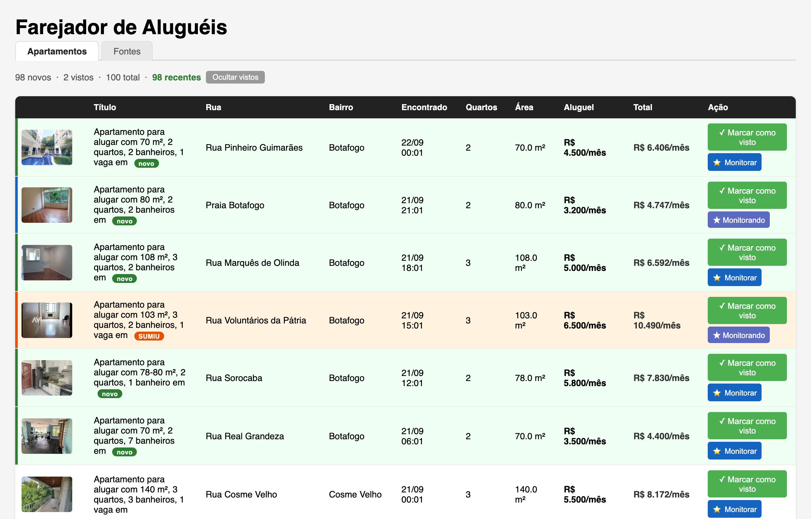

<p align="center"></p>
<h1 align="center">Farejador de Aluguéis</h1>

<p align="center">
  Vigia as suas buscas do VivaReal e avisa na hora em que aparece um apartamento novo dentro do seu orçamento.
</p>

<p align="center">
  <a href="https://github.com/dgslv/farejador-alugueis/releases/latest"></a>
  <a href="https://github.com/dgslv/farejador-alugueis/actions/workflows/ci.yml"></a>
  <a href="LICENSE"></a>
  
</p>

<p align="center"><a href="README.en.md">🇺🇸 English</a></p>



Procurar apartamento é uma corrida: os anúncios bons somem em horas. Em vez de recarregar o VivaReal o dia inteiro, o Farejador faz isso por você. A cada 15 minutos (você escolhe o intervalo) ele visita as buscas que você cadastrou, guarda tudo num banco no seu computador e manda uma notificação quando encontra algo novo que cabe no seu **orçamento total** — aluguel + condomínio + IPTU, que é o que sai do bolso de verdade.

- **Tudo local.** Nenhum dado sai da sua máquina: sem servidor, sem conta, sem cadastro.
- **Feito para quem está procurando de verdade.** Marque o que já viu, monitore os favoritos e saiba quando um anúncio some do site (provavelmente alugou).
- **Gratuito e aberto.** Código sob licença MIT; qualquer pessoa pode ler, sugerir e melhorar.

## Baixar e instalar

Não precisa saber programar. Vá em **[Releases](https://github.com/dgslv/farejador-alugueis/releases/latest)** e baixe o arquivo do seu computador:

| Computador | Arquivo |
|---|---|
| Mac com chip Apple (M1, M2, M3, M4…) | `Farejador-X.Y.Z-macOS-arm64.dmg` |
| Mac com processador Intel | `Farejador-X.Y.Z-macOS-x86_64.dmg` |
| Windows 10 ou 11 (64 bits) | `Farejador-X.Y.Z-Windows-x64.exe` |

> Não sabe qual Mac você tem? Menu  → **Sobre Este Mac**. Se aparecer "Chip Apple M…", é Apple; se aparecer "Processador Intel…", é Intel.

### macOS

1. Abra o `.dmg` e arraste **Farejador** para a pasta **Aplicativos**.
2. Na primeira abertura, o macOS avisa que "não foi possível verificar o desenvolvedor". Isso acontece porque o app não é assinado com uma conta de desenvolvedor da Apple (custa US$ 99 por ano); o código é aberto e você pode conferi-lo aqui.
3. Vá em **Ajustes do Sistema → Privacidade e Segurança**, role até o aviso sobre o Farejador e clique em **Abrir Mesmo Assim**. Só precisa fazer isso uma vez.

   Alternativa pelo Terminal: `xattr -cr /Applications/Farejador.app`

### Windows

1. Execute o `.exe` — pode ficar em qualquer pasta, não há instalador.
2. O SmartScreen mostra "O Windows protegeu o computador". Clique em **Mais informações → Executar assim mesmo**. Também é só na primeira vez.

### Primeira abertura

O Farejador usa um navegador próprio (Chromium) para ler o site. Na primeira vez ele baixa esse navegador (~300 MB) e mostra a tela "Configurando o Farejador…". Pode levar alguns minutos; depois disso a abertura é imediata.

## Como usar

1. No seu navegador, abra o [VivaReal](https://www.vivareal.com.br), monte a busca do jeito que quiser (cidade, bairros, quartos, preço, área) e **copie a URL** da barra de endereço.
2. No Farejador, aba **Fontes** → cole a URL, dê um nome (ex. "Botafogo 2 quartos") → **Adicionar**. Cadastre quantas buscas quiser; cada uma pode ser pausada ou removida depois.
3. Ainda em **Fontes**, ajuste o **preço total máximo** (aluguel + condomínio + IPTU) e o **intervalo** entre as buscas. Anúncios acima do teto são ignorados. O botão **Testar notificação** confirma que os avisos estão chegando (no macOS, aceite quando o sistema perguntar se o Farejador pode notificar).
4. Deixe o app aberto (pode minimizar). A primeira busca só guarda o que já está no site, sem avisar — senão seriam dezenas de notificações de uma vez. A partir daí, cada anúncio novo gera uma notificação e aparece na aba **Apartamentos** com a marca **novo**.
5. Na lista: clique num anúncio para ver as fotos e o preço detalhado, e **Abrir anúncio** para ir ao VivaReal. **Marcar como visto** tira da frente o que você já avaliou. **Monitorar** marca um favorito: se ele sumir do site, o Farejador mostra a marca **SUMIU** — bom sinal de que já foi alugado.

## Onde ficam os meus dados

| Sistema | Pasta |
|---|---|
| macOS | `~/Library/Application Support/Farejador/` |
| Windows | `%APPDATA%\Farejador\` |
| Linux (do código-fonte) | `~/.farejador/` |

Lá dentro: `listings.db` (anúncios, fontes e configurações), `alerts.log` (histórico dos avisos), `app.log` (diagnóstico — anexe nos relatos de problema) e `ms-playwright/` (o navegador). Para começar do zero, feche o app e apague a pasta. A variável de ambiente `FAREJADOR_DATA_DIR` muda a pasta (útil para instalações portáteis).

Algo deu errado? Veja [Solução de problemas](docs/solucao-de-problemas.md).

## Rodar a partir do código-fonte

Para quem programa ou quer usar no Linux. Requisitos: [Python](https://www.python.org/downloads/) 3.9 ou mais novo (o CI e os instaladores usam 3.11) e Git.

```bash
git clone https://github.com/dgslv/farejador-alugueis.git
cd farejador-alugueis
python -m venv .venv && source .venv/bin/activate   # Windows: .venv\Scripts\activate
pip install -e .
playwright install chromium
farejador
```

| Comando | O que faz |
|---|---|
| `farejador` | App completo, em janela nativa (o mesmo que o instalador) |
| `farejador --headless` | Só o robô de busca, no terminal |
| `farejador --dashboard` | Só o painel, em <http://127.0.0.1:8080> no seu navegador |
| `packaging/build-macos.sh` · `packaging\build-windows.bat` | Gera o `.dmg` / `.exe` em `dist/` |

Porta ocupada? `FAREJADOR_PORT=8090 farejador`. Outra pasta de dados? `FAREJADOR_DATA_DIR=/caminho farejador`.

## Como funciona

```
  a cada N min          Chromium headless            SQLite             janela nativa
 ┌──────────────┐ URLs ┌───────────────────┐ cards ┌──────────┐ HTML ┌──────────────┐
 │ scheduler.py │ ───▶ │scrapers/vivareal.py│ ────▶ │  db.py   │ ◀──▶ │ web/ (Flask) │
 │  agendador   │      │    Playwright     │       │listings.db│      │ em desktop.py│
 └──────────────┘      └───────────────────┘       └──────────┘      └──────────────┘
        │ anúncio novo dentro do orçamento
        └──────▶ notify.py → notificação do sistema + alerts.log
```

Detalhes de cada peça, esquema do banco e decisões de projeto: [docs/como-funciona.md](docs/como-funciona.md).

## Contribuindo

Issues e pull requests são bem-vindos — de correção de digitação a funcionalidade nova. Comece por [CONTRIBUTING.md](CONTRIBUTING.md) (ambiente, testes, padrão de commits) e pelo [Código de Conduta](CODE_OF_CONDUCT.md).

**Regras de merge**, em resumo — a versão completa está em [GOVERNANCE.md](GOVERNANCE.md):

- Toda mudança em `main` entra por pull request, com CI verde (lint + testes em macOS, Windows e Linux).
- **Qualquer pessoa pode revisar** um PR: testar, comentar, aprovar ou pedir mudanças.
- **Só o mantenedor ([@dgslv](https://github.com/dgslv)) faz o merge.** A aprovação dele é obrigatória (`CODEOWNERS`) e as regras são impostas pelo GitHub, não por combinado.

Achou uma falha de segurança? Não abra issue pública — siga [SECURITY.md](SECURITY.md).

## Aviso legal e uso responsável

O Farejador é uma ferramenta de uso pessoal: automatiza o que você faria à mão (abrir a sua busca e olhar os anúncios novos). Não é afiliado ao VivaReal nem ao Grupo OLX. Use com bom senso: mantenha intervalos razoáveis (o padrão é 15 minutos), não use o app para coletar dados em massa nem para redistribuí-los, e respeite os termos de uso do site. Os dados coletados são anúncios públicos e ficam só no seu computador.

## Licença

[MIT](LICENSE) © Diego Silva. Use, modifique e redistribua à vontade — só mantenha o aviso de copyright.
